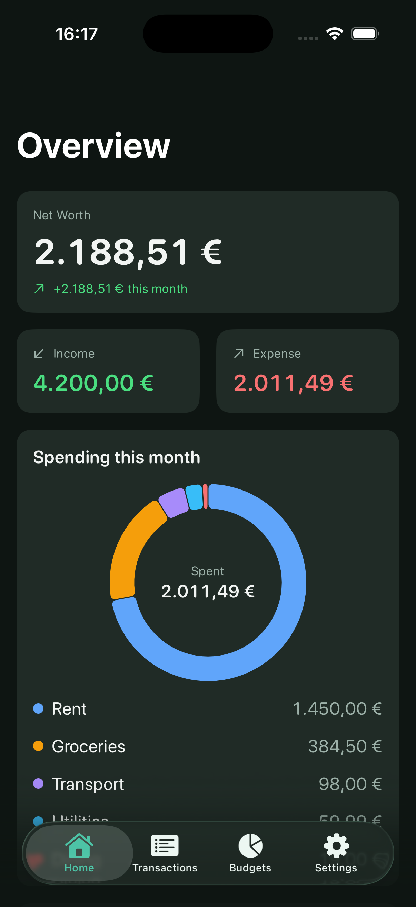
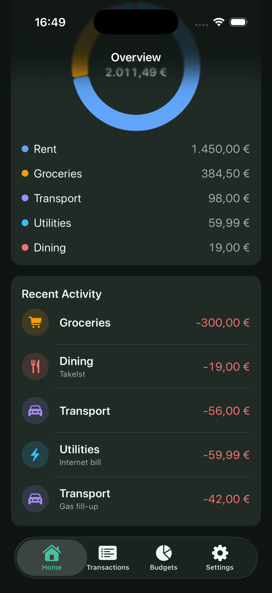
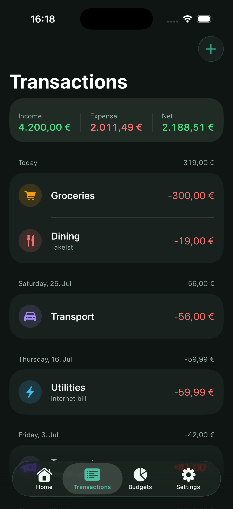
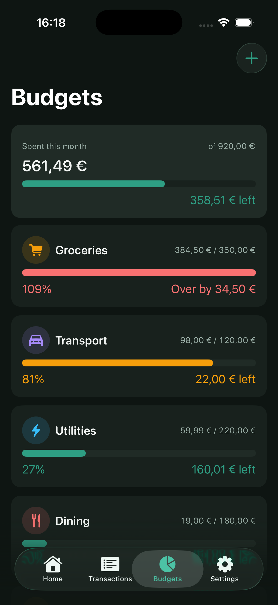

# Vaultly

**A privacy-first personal finance manager for iOS.** Track transactions, set budgets, and see where your money goes — all stored securely on your device, never on a server.

Built with SwiftUI and SwiftData as a showcase of modern native iOS development.

<!-- Add screenshots here once uploaded to the repo:
<p align="center">
  
    
  
  
</p>
-->

---

## Features

- **Home overview** — net worth, monthly income/expense summary, and an interactive spending-by-category donut chart built with Swift Charts.
- **Transactions** — grouped-by-day list with per-day totals, add/delete, and category & account tagging.
- **Budgets** — per-category limits on a weekly, monthly, or yearly period, with live progress bars: teal while under 80% of the limit, amber from 80% up to the limit, and red once you go over.
- **Multi-currency support** — pick from 11 major currencies in Settings; amounts reformat instantly across the app, with each currency rendered in its own native number style (e.g. `1,50,000.00 ₹` for INR, `3.200,00 €` for EUR).
- **Security** — the entire app is gated behind Face ID (or Touch ID, with an automatic passcode fallback if biometrics fail or aren't available), plus a privacy screen that blurs financial data in the app switcher.
- **Data control** — export all transactions to CSV via the system share sheet, or wipe all data with a guarded confirmation. Your data is yours.

---

## Tech Stack

| Area | Technology |
|------|-----------|
| Language | Swift 5 |
| UI | SwiftUI |
| Persistence | SwiftData |
| Charts | Swift Charts |
| Security | LocalAuthentication (Face ID), Keychain |
| Minimum target | iOS 18+, Xcode 16+ |

---

## Architecture

Vaultly follows a feature-first MVVM architecture with the Repository pattern. Each feature (Home, Transactions, Budget, Settings) is self-contained, owning its views, view models, repositories, and business logic to promote modularity, maintainability, and scalability.

- **Models** are SwiftData `@Model` types (`Transaction`, `Account`, `Category`, `Budget`) with explicit relationship delete rules.
- **Repositories** are protocol-backed and own all data access for a single model type, keeping SwiftData out of the view models and making the logic testable via mock repositories.
- **View models** are @Observable and @MainActor types that manage UI state, coordinate data flow through repositories, and provide data to the views.
- **Views** are lightweight SwiftUI, driving all currency display through a single `CurrencyFormatter` at the edge.

A few deliberate design decisions:

- **Money is always `Decimal`, never `Double`** — amounts are stored as positive magnitudes with direction held by a `TransactionType` enum, so signed values are derived at read time.
- **`@AppStorage` for preferences, SwiftData for financial data** — the right tool for each kind of state.
- **Currency and locale are independent** — the user picks the currency; each currency formats in its own canonical locale, so the number style always matches the money.

```
Vaultly/
├── App/            # Entry point, auth gate, model container
├── Core/
│   ├── DesignSystem/   # Theme: colors, typography, spacing
│   ├── Utilities/      # CurrencyFormatter
│   ├── Security/       # AppLockManager, Keychain, privacy screen
│   └── Persistence/    # Container, repositories, sample data
├── Models/         # SwiftData models + enums
└── Features/       # Home, Transactions, Budgets, Settings, Lock
```

---

## Getting Started

1. Clone the repo:
```bash
   git clone https://github.com/sharvanik21/Vaultly.git
```
2. Open `Vaultly.xcodeproj` in Xcode 16 or later.
3. Build and run on an iOS 18+ simulator or device.

The app launches with an empty ledger — start by adding your own accounts and transactions.

---

## Roadmap

- Account management screen (add/edit/rename/delete accounts)
- Transaction detail & editing
- Per-account currencies with an active-account scope (multi-account support)
- Exchange-rate conversion for a combined multi-currency net worth
- Category management screen (add/edit/rename/recolor)

---

## Author

**Sharvani Karrepu** — iOS Engineer
[LinkedIn](https://linkedin.com/in/sharvanikarrepu) · [GitHub](https://github.com/sharvanik21)
